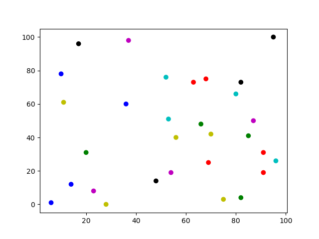
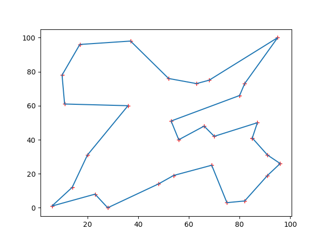
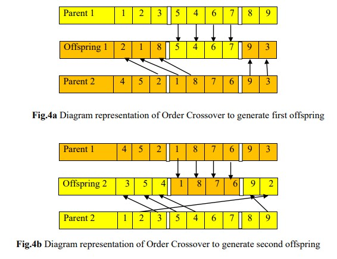

# GA based Path Generation
The Genetic algorithm was used to find the shortest path between all nodes, such that each node is traversed only once (Travelling Salesman Problem).

## Results from code

### Randomly generated cities

### Path generated by the algorithm

### Order Crossover Function and Reference
#### Steps for Order Crossover
	1) Select two cut points randomly between the genes of each parent.
	
	2) The consecutive alleles between two cut points (5 4 6 7) from Parent 1
	are copied to the Offspring 1 as shown in Fig a.
	
	3) Then, the rest of the genes are copied in the order in which they appear
	in the Parent 2 starting after the second cut point (exclude the value if
	it is already inserted) till all positions are filled. 
	
	4) In order to get the Offspring 2, follow the same procedure by
	exchanging the positions of the two parents Parent 1 and Parent 2 as
	shown in Fig b.
	

#### Reference:
[Kumar S G, Varun & Panneerselvam, Ramasamy. (2017). A Study of Crossover Operators for Genetic Algorithms to Solve VRP and its Variants and New Sinusoidal Motion Crossover Operator. International Journal of Computational Intelligence Research. Volume 13. Page 1717-1733.](https://www.ripublication.com/ijcir17/ijcirv13n7_15.pdf)

### How to use
	Please Run the main.py file, with both GA.py and city.py placed in the same folder as main.py.

	1) solve() in GA.py has the population_size, Crossover_number and mutation_rate defined.
	   These can be changed to make the solution more accurate.
	   Default values are pop_size = 150, crossover = 90/150, mutation_rate = 0.001 and 500 iters.

	2) Increase pop_size and iters for perfect solution. pop_size = 2000, crossover = 900
           and iters = 500, with mutation turned off gave me the best results.

	3) To use Manhattan distance, go to solve() in GA.py file and change 
	   genAlg.generate_distance_table() to genAlg.generate_manhattan_disance_table().

